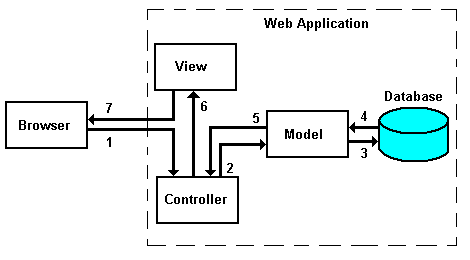
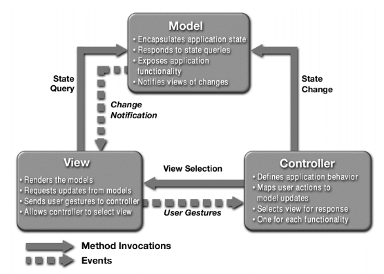

# Framework Overview

Model-View-Controller (MVC) is probably one of the most quoted patterns in the web programming world in recent years. Anyone currently working in anything related to web application development will have heard or read the acronym hundreds of times. Today, we'll clarify what MVC means, and why it has become so popular. 

Hazaar implements the MVC pattern in PHP, making it easy to build large scale web applications.

## History of Hazaar MVC

> MVC is not a design pattern, it is an Architectural pattern that describes a way to structure our application and the responsibilities and interactions  for each part in that structure.
>
> --source: unknown

It was first described in 1979 and, obviously, the context was a little bit different. The concept of web application did not exist. Tim Berners Lee sowed the seeds of World Wide Web in the early nineties and changed the world forever. The pattern we use today for web development is an adaptation of the original pattern.

The wild popularization of this structure for web applications is due to its inclusion in two development frameworks that have become immensely popular: Struts and Ruby on Rails. These two environments marked the way for the hundreds of frameworks created later.

## MVC for Web Applications

The idea behind the Model-View-Controller architectural pattern is simple: we must have the following responsibilities clearly separated in our application:

The application is divided into these three main components, each one in charge of different tasks. Let's see a detailed explanation and an example.

### Controller

The Controller manages the user requests (received as HTTP GET or POST requests when the user clicks on GUI elements to perform actions). Its main function is to call and coordinate the necessary resources/objects needed to perform the user action. Usually the controller will call the appropriate model for the task and then selects the proper view.

### Model

The Model is the data and the rules applying to that data, which represent concepts that the application manages. In any software system, everything is modeled as data that we handle in a certain way. What is a user, a message or a book for an application? Only data that must be handled according to specific rules (date can not be in the future, e-mail must have a specific format, name cannot be more than x characters long, etc).

The model gives the controller a data representation of whatever the user requested (a message, a list of books, a photo album, etc). This data model will be the same no matter how we may want to present it to the user, that's why we can choose any available view to render it.

The model contains the most important part of our application logic, the logic that applies to the problem we are dealing with (a forum, a shop, a bank, etc). The controller contains a more internal-organizational logic for the application itself (more like housekeeping).

### View

The View provides different ways to present the data received from the model. They may be templates where that data is filled. There may be several different views and the controller has to decide which one to use.

A web application is usually composed of a set of controllers, models and views. The controller may be structured as a main controller that receives all requests and calls specific controllers that handles actions for each case.