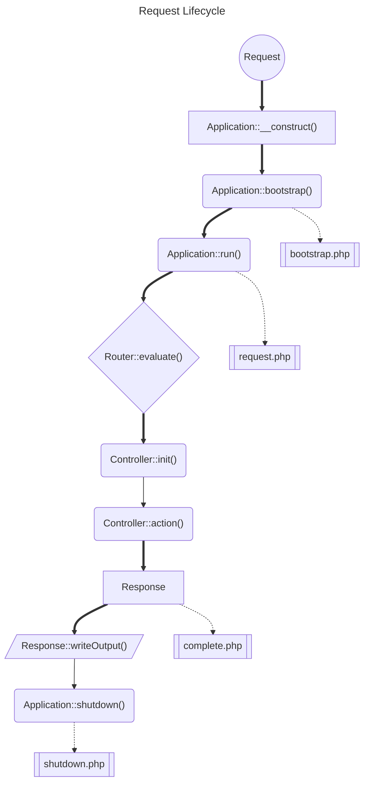
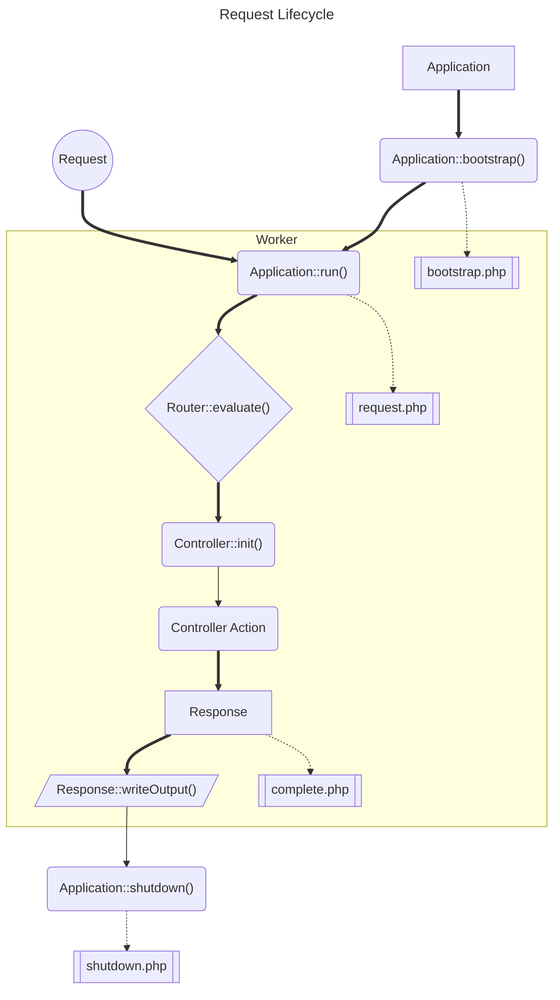

# Request Lifecycle

## Introduction

The entry point for all requests in Hazaar MVC is the `index.php` file.  This file is responsible for instantiating, bootstrapping
and executing the application.  The request lifecycle is the process that a request goes through from the time it is received by
the application to the time the response is sent back to the client.

## Lifecycle Scripts

Hazaar MVC provides a number of lifecycle scripts that are executed at various points in the request lifecycle.  These scripts are executed in the order they are listed below.

1. `bootstrap.php` - This script is executed when the application is started and being bootstrapped.
2. `request.php` - This script is executed after the request has been parsed but before the router is executed.
3. `complete.php` - This script is executed after the controller has been executed and the view has been written to the output buffer.
4. `shutdown.php` - This script is executed when the application is shutting down.

## Standard Request Lifecycle

Below is a diagram of the standard request lifecycle in Hazaar MVC.  This diagram shows the various stages of the request lifecycle and demonstrates the linear flow of the request through the application. 

### Request

The request is received by the `index.php` entry point script.  This script will instantiate the application, call the `bootstrap()` method and then execute the application with the `run()` method.

### `Application::__construct()`

Here is where the application is instantiated.  This is the first step in the request lifecycle and is where the application configuration is loaded, timers are started and the application is prepared for execution.

### `Application::bootstrap()`

This is where the application is bootstrapped.  Here, the router is initialised which is when some router engines can load their routes.

At this point the optional `bootstrap.php` lifecycle script is executed.

### `Application::run()`

The application is executed.  At this point the request is parsed and the router is executed to determine the controller to dispatch.

The optional `request.php` lifecycle script is also executed.

### `Router::evaluate()`

The router is executed to determine the controller to dispatch.  The router will parse the request and determine the controller to dispatch.

### `Controller::init()`

The controller is instantiated and initialised.  This is where the controller is instantiated and the controller's `init()` method is called.  The `init()` method can be used to perform any initialisation that is required before the controller is executed such as loading models, setting up the view or verifying user permissions.

### `Controller::action()`

This is where the controller action is executed.  The controller action is the method that is called to handle the request and return
a valid `Hazaar\Controller\Response` object.

### Response

The response is generated by the controller and returned to the application.

### `Response::writeOutput()`

The response is written to the output buffer.  This is where the response is written to the output buffer and the response is sent back to the client.

At this point the optional `complete.php` lifecycle script is executed.

### `Application::shutdown()`

The application is shutdown.  This is where the application is shutdown and any cleanup tasks are performed.

At this point the optional `shutdown.php` lifecycle script is executed.

## Worker Mode Request Lifecycle

The worker mode request lifecycle is similar to the standard request lifecycle but with some differences.  The worker mode request lifecycle is designed to be used in long running processes such as daemons or workers.  In this mode, the application is created
and bootstrapped once and then the `run()` method is called once for each request.

::: tip
In worker mode, routes are loaded once when the application is bootstrapped.  If routes are loaded programmatically from a database or other source, then it is suggested to use this mode to maintain performance.
:::

::: tip
In worker mode, the `bootstrap.php` and `shutdown.php` lifecycle scripts are only executed once when the application is started and shutdown.  The `request.php` and `complete.php` lifecycle scripts are executed for each request.
:::
