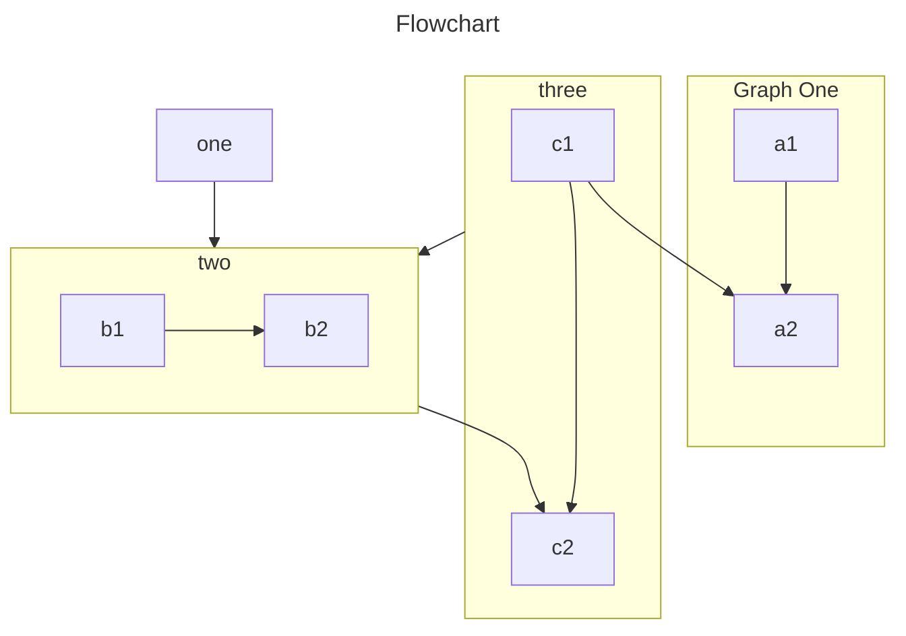

## Why Choose Hazaar MVC?

PHP MVC frameworks are essential for building robust and scalable web applications. They provide a structured way to separate concerns, making your code more maintainable and easier to understand. Among these frameworks, Hazaar MVC stands out for its exceptional performance, simplicity, and powerful features.

Hazaar MVC is not just another PHP MVC framework; it's a high-performance solution designed to streamline your development process. With its efficient codebase, built-in database ORM, and realtime WebSockets server, Hazaar MVC empowers developers to create dynamic and responsive web applications with ease.

Experience the power and flexibility of Hazaar MVC and take your web development to the next level.

# Badges

- VuePress - <Badge type="tip" text="Tip" vertical="top" />
- VuePress - <Badge type="warning" text="Warning" vertical="middle" />
- VuePress - <Badge type="danger" text="Danger" vertical="bottom" />
- VuePress - <Badge type="important" text="Important" vertical="middle" />
- VuePress - <Badge type="info" text="Info" vertical="middle" />
- VuePress - <Badge type="note" text="Note" vertical="middle" />

# Tips

::: tip
This is a tip
:::

::: warning
This is a warning
:::

::: danger
This is a dangerous warning
:::

::: info
This is an information.
:::

::: important
This is an important message
:::

::: note
This is a note
:::

::: details
This is a details block
:::

# Code Tabs

::: code-tabs

@tab JavaScript

```js
const name = 'VuePress'
console.log(`Hello, ${name}!`)
```

@tab TypeScript

```ts
const name: string = 'VuePress'

console.log(`Hello, ${name}!`)
```

:::

# Tabs

::: tabs

@tab Tab1

This is the content of Tab1.

```js
console.log('Hello, VuePress!')
```

@tab Tab2

This is the content of Tab2.

- List item 1
- List item 2
- List item 3

:::

# Flowchart

```flow
st=>start: Start|past:>http://www.google.com[blank]
e=>end: End|future:>http://www.google.com
op1=>operation: My Operation|past
op2=>operation: Stuff|current
sub1=>subroutine: My Subroutine|invalid
cond=>condition: Yes
or No?|approved:>http://www.google.com
c2=>condition: Good idea|rejected
io=>inputoutput: catch something...|future

st->op1(right)->cond
cond(yes, right)->c2
cond(no)->sub1(left)->op1
c2(yes)->io->e
c2(no)->op2->e
```

# ESChart

<!-- #include-env-start: /home/runner/work/vuepress-theme-hope/vuepress-theme-hope/docs/md-enhance/src/echarts -->
::: echarts A bar chart

```js
const data = [];

for (let i = 0; i < 5; i++) data.push(Math.round(Math.random() * 200));

const option = {
  xAxis: {
    max: "dataMax",
  },
  yAxis: {
    type: "category",
    data: ["A", "B", "C", "D", "E"],
    inverse: true,
    animationDuration: 300,
    animationDurationUpdate: 300,
    max: 2, // only the largest 3 bars will be displayed
  },
  series: [
    {
      realtimeSort: true,
      name: "X",
      type: "bar",
      data: data,
      label: {
        show: true,
        position: "right",
        valueAnimation: true,
      },
    },
  ],
  legend: {
    show: true,
  },
  toolbox: {
    show: true,
    feature: {
      mark: {
        show: true,
      },
      dataView: {
        show: true,
        readOnly: false,
      },
      restore: {
        show: true,
      },
      saveAsImage: {
        show: true,
      },
    },
  },
  animationDuration: 0,
  animationDurationUpdate: 3000,
  animationEasing: "linear",
  animationEasingUpdate: "linear",
};
const run = () => {
  for (let i = 0; i < data.length; i++)
    data[i] += Math.round(Math.random() * Math.random() > 0.9 ? 2000 : 200);

  myChart.setOption({
    series: [{ type: "bar", data }],
  });
};

const timeId = setInterval(() => {
  if (myChart._disposed) return clearInterval(timeId);

  run();
}, 3000);
```

:::

<!-- #include-env-end -->

# Markmap

````markmap
---
markmap:
  colorFreezeLevel: 2
---

# markmap

## Links

- <https://markmap.js.org/>
- [GitHub](https://github.com/markmap/markmap)

## Features

- links
- **strong** ~~del~~ *italic* ==highlight==
- multiline
  text
- `inline code`
-
    ```js
    console.log('code block');
    ```
- Katex
  - $x = {-b \pm \sqrt{b^2-4ac} \over 2a}$
- Now we can wrap very very very very long text based on `maxWidth` option
````

# Mermaid



